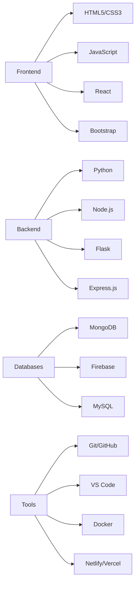

# 💫 **Tanzeel Ahmed**  
### **Full Stack Developer | Web Specialist | Tech Innovator**

<p align="center">
  
</p>

<div align="center">
  
  
  
  
  

</div>

---

## 🎯 **About Me**

```javascript
const developer = {
  name: "Tanzeel Ahmed",
  role: "Full Stack Web Developer",
  location: "Pakistan",
  expertise: ["Python", "Flask", "HTML/CSS", "JavaScript", "APIs", "React", "Node.js"],
  currentlyLearning: ["React Native", "Next.js", "AWS", "Docker"],
  hobbies: ["Coding", "Photography", "Rubik's Cube", "Building Projects"],
  availability: "Open for Freelance & Collaborations",
  contact: "tanzeel.ahmed.se@gmail.com"
};
```

### **Currently:**
- 🔭 **Working on:** Building a full-featured TechStore e-commerce platform with modern UI/UX and dark/light theme toggle
- 🌱 **Learning:** React Native, Next.js, AWS, Docker, and advanced backend concepts
- 👯 **Looking to collaborate on:** Open source web projects, React/Node.js apps, and innovative SaaS solutions
- 🤔 **Looking for help with:** Cloud deployment, application scaling, and performance optimization
- 💬 **Ask me about:** Web development, JavaScript, React, responsive design, and Pakistan's tech scene
- ⚡ **Fun fact:** I can solve a Rubik's cube in under 2 minutes and once built a complete website in 24 hours!

---

## 🌐 **Connect With Me**

[](https://bsky.app/profile/@tanzeel412.bsky.social)
[](https://linkedin.com/in/tanzeel-ahmed-b21288397)
[](https://x.com/TanzeelOnX)
[](https://github.com/Tanzeel804)
[](https://instagram.com/tanzeelahmedpov)
[](https://youtube.com/@tanzeelahmed_dev)
[](mailto:tanzeel.ahmed.se@gmail.com)

---

## 🚀 **Tech Stack**

### **💻 Languages**


### **⚡ Frontend**


### **🔧 Backend & Databases**


### **🛠️ Tools & Platforms**


### **🎨 Design**


---

## 📊 **GitHub Analytics**

<div align="center">

<table>
  <tr>
    <td align="center">
      
    </td>
    <td align="center">
      
    </td>
  </tr>
  <tr>
    <td align="center">
      
    </td>
    <td align="center">
      
    </td>
  </tr>
  <tr>
    <td colspan="2" align="center">
      
    </td>
  </tr>
</table>

</div>

---

## 🏆 **Featured Projects**

### **🎯 1. Portfolio Website**  
> **Modern & Responsive Personal Portfolio**

<p align="center">
  <a href="https://tanzeel804.github.io/portfolio-main/">
    
  </a>
</p>

**Live Demo:** 🔗 [View Portfolio](https://tanzeel804.github.io/portfolio-main/)  
**Tech Stack:** `HTML5` `CSS3` `JavaScript` `Bootstrap` `Netlify`  
**Features:** Modern UI/UX, Fully Responsive, Fast Loading, Contact Form, Project Showcase

---

### **🌤️ 2. Weather App**  
> **Real-time Weather Information App**

<p align="center">
  <a href="https://tanzeel804.github.io/weather-app/">
    
  </a>
</p>

**Live Demo:** 🔗 [Check Weather](https://tanzeel804.github.io/weather-app/)  
**Tech Stack:** `HTML5` `CSS3` `JavaScript` `Weather API` `Netlify`  
**Features:** Real-time Weather, Location-based, City Search, Weather Details, Beautiful UI

---

### **📰 3. News Hub**  
> **Latest News Aggregator Website**

<p align="center">
  
</p>

**Tech Stack:** `Python` `Flask` `Bootstrap` `NewsAPI` `HTML/CSS`  
**Features:** Latest News, Multiple Categories, Search Functionality, Responsive Design

---

### **🌡️ 4. Temperature Converter**  
> **Temperature Unit Conversion Tool**

<p align="center">
  
</p>

**Tech Stack:** `HTML5` `CSS3` `JavaScript` `Bootstrap` `Web`  
**Features:** Multi-unit Conversion, Real-time Calculation, Clean Interface, Mobile Friendly

---

## 📈 **Project Progress**

### **🟢 Live & Complete**
1. **Portfolio Website** - Live on GitHub Pages
2. **Weather App** - Live on GitHub Pages
3. **Temperature Converter** - Complete
4. **File Organizer** - Complete

### **🟡 In Progress**
1. **TechStore E-commerce** - Under Development
2. **News Hub** - Under Development
3. **React Native App** - Learning Phase

### **🔵 Planned**
1. **Task Management App**
2. **Blog Platform with CMS**
3. **AI-Powered Web Tools**

---

## 🌟 **Skills Overview**



---

## 🎓 **Learning Journey**

### **Currently Mastering:**
- ⚛️ **React Native** - Mobile App Development
- 🟢 **Next.js** - Server-side Rendering
- ☁️ **AWS** - Cloud Deployment
- 🐳 **Docker** - Containerization
- 🗄️ **Advanced Databases** - MongoDB Atlas, Firebase

### **Completed:**
- ✅ **Python Fundamentals & Flask**
- ✅ **Web Development Basics**
- ✅ **Git & GitHub Mastery**
- ✅ **API Integration**
- ✅ **Responsive Design Principles**
- ✅ **JavaScript ES6+ Features**

---

## 📊 **Development Activity**

```text
🌐 Frontend Development  ████████████████████░░░░   85%
⚡ Backend Development   ████████████████░░░░░░░░   70%
📱 Mobile Development   █████████░░░░░░░░░░░░░░░   45%
☁️ Cloud & DevOps       ████████░░░░░░░░░░░░░░░░   40%
🎨 UI/UX Design         ████████████████░░░░░░░░   70%
```

---

## 🏅 **Achievements & Certifications**

<div align="center">

| **Skill** | **Level** | **Projects** |
|-----------|-----------|--------------|
| Web Development | Advanced | 25+ Projects |
| Python Programming | Intermediate | 10+ Projects |
| React.js | Intermediate | 5+ Projects |
| API Integration | Intermediate | 3+ Projects |
| Git/GitHub | Advanced | All Projects |
| Responsive Design | Intermediate | 15+ Projects |

</div>

---

## 📝 **Latest Updates**

### **December 2025**
- ✅ Portfolio Website Updated & Enhanced
- ✅ Weather App Optimized with New Features
- 🔄 TechStore E-commerce Platform in Development
- 📚 Learning React Native for Mobile Development
- 🤝 Open for New Collaborations & Projects

### **Coming Soon**
- 🚀 TechStore E-commerce Launch
- 🔥 More Full-Stack Projects
- 🌐 Advanced Cloud Deployment Tutorials
- 📱 Mobile App Development

---

## 🤝 **Collaboration & Opportunities**

### **I'm Available For:**
- 💼 **Freelance Web Development Projects**
- 🤝 **Open Source Collaborations**
- 🎯 **Full-Stack Development Roles**
- 💡 **Tech Consulting & Mentorship**
- 🚀 **Startup Projects & MVPs**

### **My Expertise Includes:**
✅ Custom Website Development  
✅ Responsive Web Design  
✅ API Integration & Development  
✅ E-commerce Solutions  
✅ Web Application Deployment  
✅ Performance Optimization  

---

## 📞 **Get In Touch**

**Response Time:** Within 24 Hours  
**Availability:** Open for discussions anytime!

**Preferred Contact Methods:**
1. 📧 **Email:** tanzeel.ahmed.se@gmail.com
2. 💼 **LinkedIn:** linkedin.com/in/tanzeel-ahmed-b21288397
3. 🐦 **X/Twitter:** @TanzeelOnX
4. 💬 **GitHub Discussions**

---

## 🎯 **Quote of the Day**

<div align="center">

> ### **"The best way to predict the future is to create it."**  
> *— Peter Drucker*

</div>

---

<p align="center">
  
</p>

<div align="center">
  
  ### ⭐ **Check out my repositories and star if you like them!** ⭐
  
  **Last Updated:** December 2025
  
  

  <br>
  
  [](https://visitcount.itsvg.in)

</div>

---

<div align="center">
  
  **Proudly crafted with dedication and ❤️ by Tanzeel Ahmed**
  
  *"Code is like humor. When you have to explain it, it's bad." - Cory House*

</div>

---

## 🎨 **Quick Stats Summary**

| Metric | Status |
|--------|--------|
| **Total Repositories** | 8+ |
| **Stars Earned** | Growing Daily |
| **Projects Completed** | 15+ |
| **Technologies Used** | 20+ |
| **Years Coding** | 2+ |
| **Availability** | Open for Projects |

---

**Note:** This README is dynamically updated. Last refresh: December 2025

---

<div align="center">
  
  [](https://github.com/Tanzeel804)
  [](https://github.com/Tanzeel804)

</div>
