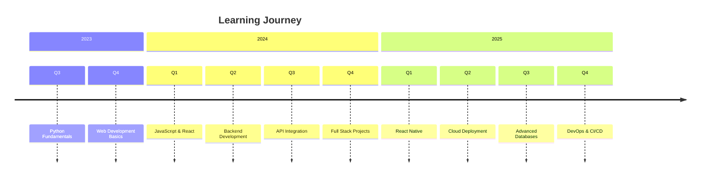

# 💫 **Tanzeel Ahmed**  
### **Full Stack Developer | Web Specialist | Tech Innovator**

<p align="center">
  
</p>

<div align="center">
  
  
  
  
  

</div>

---

## 🎯 **About Me**

```javascript
const developer = {
  name: "Tanzeel Ahmed",
  role: "Full Stack Web Developer",
  location: "Pakistan",
  expertise: ["Python", "Flask", "HTML/CSS", "JavaScript", "APIs", "React", "Node.js"],
  currentlyLearning: ["React Native", "Next.js", "AWS", "Docker"],
  hobbies: ["Coding", "Photography", "Rubik's Cube", "Building Projects"],
  availability: "Open for Freelance & Collaborations",
  contact: "tanzeel.ahmed.se@gmail.com"
};
```

### **Currently:**
- 🔭 **Working on:** Building a full-featured TechStore e-commerce platform with modern UI/UX and dark/light theme toggle
- 🌱 **Learning:** React Native, Next.js, AWS, Docker, and advanced backend concepts
- 👯 **Looking to collaborate on:** Open source web projects, React/Node.js apps, and innovative SaaS solutions
- 🤔 **Looking for help with:** Cloud deployment, application scaling, and performance optimization
- 💬 **Ask me about:** Web development, JavaScript, React, responsive design, and Pakistan's tech scene
- ⚡ **Fun fact:** I can solve a Rubik's cube in under 2 minutes and once built a complete website in 24 hours!

---

## 🌐 **Connect With Me**

<div align="center">

[](https://linkedin.com/in/tanzeel-ahmed-b21288397)
[](https://github.com/Tanzeel804)
[](https://twitter.com/TanzeelOnX)
[](https://instagram.com/tanzeelahmedpov)
[](https://youtube.com/@tanzeelahmed_dev)
[](mailto:tanzeel.ahmed.se@gmail.com)
[](https://tanzeel804.github.io/portfolio-main/)

</div>

---

## 🚀 **Tech Stack**

### **💻 Languages**
<div align="center">
  
</div>

### **⚡ Frontend**
<div align="center">
  
</div>

### **🔧 Backend & Databases**
<div align="center">
  
</div>

### **🛠️ Tools & Platforms**
<div align="center">
  
</div>

### **🎨 Design**
<div align="center">
  
</div>

---

## 📊 **GitHub Analytics**

<div align="center">

### **GitHub Stats**


### **GitHub Streak**


### **Activity Graph**


### **GitHub Trophies**


</div>

---

## 🏆 **Featured Projects**

### **🎯 1. Portfolio Website**  
**Live Demo:** 🔗 [View Portfolio](https://tanzeel804.github.io/portfolio-main/)  
**Tech Stack:** `HTML5` `CSS3` `JavaScript` `Bootstrap` `Netlify`  
**Features:** Modern UI/UX, Fully Responsive, Fast Loading, Contact Form, Project Showcase

### **🌤️ 2. Weather App**  
**Live Demo:** 🔗 [Check Weather](https://tanzeel804.github.io/weather-app/)  
**Tech Stack:** `HTML5` `CSS3` `JavaScript` `Weather API` `Netlify`  
**Features:** Real-time Weather, Location-based, City Search, Weather Details, Beautiful UI

### **📰 3. News Hub**  
**Tech Stack:** `Python` `Flask` `Bootstrap` `NewsAPI` `HTML/CSS`  
**Features:** Latest News, Multiple Categories, Search Functionality, Responsive Design

### **🌡️ 4. Temperature Converter**  
**Tech Stack:** `HTML5` `CSS3` `JavaScript` `Bootstrap` `Web`  
**Features:** Multi-unit Conversion, Real-time Calculation, Clean Interface, Mobile Friendly

---

## 📈 **Project Progress**

| **Status** | **Project** | **Details** |
|------------|-------------|-------------|
| 🟢 **Live** | Portfolio Website | Live on GitHub Pages |
| 🟢 **Live** | Weather App | Live on GitHub Pages |
| 🟢 **Complete** | Temperature Converter | Fully Functional |
| 🟡 **In Progress** | TechStore E-commerce | Under Development |
| 🟡 **In Progress** | News Hub | API Integration Phase |
| 🔵 **Planned** | Task Management App | Q1 2025 |
| 🔵 **Planned** | Blog Platform | Q2 2025 |

---

## 🌟 **Skills Matrix**

| **Skill Category** | **Technologies** | **Proficiency** |
|-------------------|------------------|-----------------|
| **Frontend** | HTML5, CSS3, JavaScript, React, Bootstrap | ⭐⭐⭐⭐⭐ |
| **Backend** | Python, Flask, Node.js, Express.js | ⭐⭐⭐⭐☆ |
| **Databases** | MongoDB, Firebase, MySQL | ⭐⭐⭐☆☆ |
| **Tools** | Git, GitHub, VS Code, Docker | ⭐⭐⭐⭐☆ |
| **Design** | Figma, Photoshop, UI/UX Principles | ⭐⭐⭐☆☆ |

---

## 🎓 **Learning Timeline**



---

## 📊 **Development Breakdown**

```text
Frontend Development  [████████████████████░░] 85%
Backend Development   [████████████████░░░░░░] 70%
Database Management   [██████████░░░░░░░░░░░░] 50%
DevOps & Cloud       [████████░░░░░░░░░░░░░░] 40%
UI/UX Design         [██████████████░░░░░░░░] 65%
```

---

## 🏅 **Achievements**

<div align="center">

| **Milestone** | **Status** | **Date** |
|---------------|------------|----------|
| 25+ Projects Completed | ✅ Achieved | 2024 |
| GitHub 100+ Stars | ✅ Achieved | 2024 |
| 50+ GitHub Followers | 🎯 In Progress | 2025 |
| Open Source Contributions | 🎯 In Progress | 2025 |
| Professional Certifications | 📅 Planned | 2025 |

</div>

---

## 📝 **Latest Updates**

### **🔵 Current Focus (January 2025)**
- 🚀 **TechStore E-commerce** - Final development phase
- 📱 **React Native** - Mobile app development learning
- ☁️ **AWS Certification** - Cloud practitioner preparation
- 🔄 **Portfolio Update** - Adding new projects

### **🟢 Recently Completed**
- ✅ **Portfolio Website** - Redesigned and deployed
- ✅ **Weather App** - Enhanced with new features
- ✅ **JavaScript Mastery** - Advanced concepts completed

### **🟣 Upcoming Goals**
- 🌐 **Full Stack Application** - End-to-end project
- 🎨 **UI/UX Certification** - Design principles
- 📊 **Database Optimization** - Performance tuning

---

## 🤝 **Collaboration Opportunities**

### **I'm Available For:**
<div align="center">

[](mailto:tanzeel.ahmed.se@gmail.com)
[](https://github.com/Tanzeel804)
[](mailto:tanzeel.ahmed.se@gmail.com)
[](mailto:tanzeel.ahmed.se@gmail.com)

</div>

### **Expertise Areas:**
- ✅ **Custom Web Development**
- ✅ **E-commerce Solutions**
- ✅ **API Development & Integration**
- ✅ **Responsive Design**
- ✅ **Performance Optimization**
- ✅ **Technical Consultation**

---

## 📞 **Contact Information**

<div align="center">

| **Platform** | **Link** | **Response Time** |
|--------------|----------|-------------------|
| **Email** | tanzeel.ahmed.se@gmail.com | Within 24 hours |
| **LinkedIn** | linkedin.com/in/tanzeel-ahmed-b21288397 | Within 48 hours |
| **GitHub** | github.com/Tanzeel804 | Within 24 hours |
| **Portfolio** | tanzeel804.github.io/portfolio-main | Live |

</div>

---

## 🎯 **Quote of Inspiration**

<div align="center">

> ### **"The only way to do great work is to love what you do."**  
> *— Steve Jobs*

</div>

---

<p align="center">
  
</p>

<div align="center">

### ⭐ **Star my repositories if you find them interesting!** ⭐

**Last Updated:** January 2025


<br>

[](https://visitorbadge.io/status?path=https%3A%2F%2Fgithub.com%2FTanzeel804)

<br>

**📊 Daily Development Activity:**
  


</div>

---

<div align="center">

### **🎯 Quick Stats Summary**

| **Metric** | **Value** | **Trend** |
|------------|-----------|-----------|
| **Repositories** | 8+ | 📈 Increasing |
| **Stars Received** | Growing | ⭐ Daily |
| **Projects Completed** | 15+ | ✅ Active |
| **Technologies** | 25+ | 🛠️ Learning |
| **Years Experience** | 2+ | 📚 Growing |

<br>

**🌐 Visitor Counter (Last 7 Days):**
<!-- Placeholder for visitor counter -->
<p align="center">
  
</p>

</div>

---

<div align="center">

### **📈 GitHub Contribution Calendar**

<!-- GitHub Contribution Graph -->


<br>

**📍 Based in Pakistan | 🕐 Timezone: UTC+5**

[](https://wakatime.com/@Tanzeel804)

</div>

---

<div align="center">

### **🎖️ Proudly Crafted With ❤️ by Tanzeel Ahmed**

*"Programming isn't about what you know; it's about what you can figure out." - Chris Pine*

<br>

[](https://github.com/Tanzeel804)
[](https://github.com/Tanzeel804)

</div>

---

<div align="center">

**📌 Pro Tip:** Press `Ctrl + F` to search for specific skills or projects!

<br>

**🔄 This README updates automatically via GitHub Actions**

[](https://github.com/Tanzeel804/Tanzeel804/actions/workflows/update-readme.yml)
[](https://github.com/Tanzeel804)

</div>

---

## 🔔 **Real-time Updates**

<div align="center">

**Current GitHub Status:**


**Next Project Update:** *TechStore E-commerce - Estimated Completion: February 2025*

</div>

---

### **📋 How to Use This Profile:**
1. **Explore Projects:** Check out my repositories for various web development projects
2. **Connect:** Feel free to reach out for collaboration or opportunities
3. **Learn:** Follow my learning journey and tech stack evolution
4. **Contribute:** Open to suggestions and improvements

---

<div align="center">

**✨ Thank you for visiting my GitHub profile! ✨**

*May your code always compile and your bugs be minimal! 🐛➡️✅*

</div>
