# 🎯 **Tanzeel Ahmed | Full Stack Developer**  

<div align="center">


[](#)
[](#)
[](https://linkedin.com/in/tanzeel-ahmed)
[](mailto:tanzeel.ahmed804@gmail.com)
[](#)

</div>

---

## 👨‍💻 **About Me**

```python
class Developer:
    def __init__(self):
        self.name = "Tanzeel Ahmed"
        self.role = "Full Stack Developer"
        self.passion = "Building scalable web applications"
        self.current_focus = "MERN Stack & Cloud Technologies"
        
    def skills(self):
        return ["Python", "Flask", "JavaScript", "SQL", "APIs", "Git"]
        
    def motto(self):
        return "Write code that matters, build solutions that last."
        
me = Developer()
print(f"🚀 Welcome to {me.name}'s GitHub!")
```

<p align="center">
  
</p>

---

## 🛠 **Tech Stack**

### **Frontend Development**


### **Backend Development**


### **Tools & Platforms**


---

## 📊 **GitHub Analytics**

<div align="center">
  
<!-- GitHub Stats -->


<!-- Streak Stats -->


<!-- Top Languages -->


<!-- Trophies -->


</div>

---

## 🏆 **Featured Projects**

<table>
  <tr>
    <td width="50%">
      <h3 align="center">📰 News Hub</h3>
      <div align="center">
        
      </div>
      <p align="center">Real-time news aggregation platform with multiple sources</p>
      <div align="center">
        
        
        
      </div>
    </td>
    <td width="50%">
      <h3 align="center">🏥 Hospital Management</h3>
      <div align="center">
        
      </div>
      <p align="center">Comprehensive hospital operations management system</p>
      <div align="center">
        
        
        
      </div>
    </td>
  </tr>
  <tr>
    <td width="50%">
      <h3 align="center">🚗 Car Price Predictor</h3>
      <div align="center">
        
      </div>
      <p align="center">ML-based car price prediction system</p>
      <div align="center">
        
        
        
      </div>
    </td>
    <td width="50%">
      <h3 align="center">📁 File Organizer</h3>
      <div align="center">
        
      </div>
      <p align="center">Automated file organization tool</p>
      <div align="center">
        
        
        
      </div>
    </td>
  </tr>
</table>

---

## 📈 **Learning Roadmap**

```mermaid
graph LR
    A[Python Basics] --> B[Flask Web Dev]
    B --> C[Database & SQL]
    C --> D[REST APIs]
    D --> E[Frontend Integration]
    E --> F[Full Stack Apps]
    F --> G[Cloud Deployment]
    G --> H[MERN Stack]
    
    style A fill:#00ff88,stroke:#333,stroke-width:2px
    style B fill:#00ff88,stroke:#333,stroke-width:2px
    style C fill:#00ff88,stroke:#333,stroke-width:2px
    style D fill:#00ff88,stroke:#333,stroke-width:2px
    style E fill:#00ff88,stroke:#333,stroke-width:2px
    style F fill:#00ff88,stroke:#333,stroke-width:2px
    style G fill:#00b8ff,stroke:#333,stroke-width:2px
    style H fill:#ff00ff,stroke:#333,stroke-width:2px
```



---

## 🎯 **Currently Working On**

<div align="center">

| **Project** | **Status** | **Tech** | **Progress** |
|-------------|------------|----------|--------------|
| Advanced E-commerce Platform | 🔄 In Progress | React, Node.js, MongoDB | 79% |
| Real-time Chat Application | 📅 Planned | Socket.io, Express | 70% |
| Portfolio Website | 🔄 In Progress | Next.js, Tailwind | 83% |
| Machine Learning Models | 📚 Learning | TensorFlow, Python | 43% |

</div>

---

## 📫 **Connect With Me**

<div align="center">

[](https://github.com/Tanzeel804)
[](https://linkedin.com/in/tanzeel-ahmed)
[](https://twitter.com/tanzeel_dev)
[](https://instagram.com/tanzeel_codes)
[](https://discord.com/users/your_id)
[](https://hackerrank.com/tanzeel)

</div>

---

## 💡 **Dev Quote of the Day**

<div align="center">

> "First, solve the problem. Then, write the code."  
> — *John Johnson*

<br>


**Thanks for visiting!** ✨  
*Star some repositories if you like my work!* ⭐

</div>

---

## 🎨 **Profile Customization Guide**

To make your profile even more awesome:

1. **Add a profile banner**: Create a `banner.gif` in your profile repo
2. **Update social links**: Replace placeholder URLs with your actual profiles
3. **Add more stats**: 
   - [GitHub Readme Activity Graph](https://github.com/Ashutosh00710/github-readme-activity-graph)
   - [GitHub Readme WakaTime](https://github.com/anmol098/waka-readme-stats)
4. **Create project demos**: Add demo GIFs to your project READMEs
5. **Add achievements**: Showcase certificates, hackathons, or awards

---

<div align="center">

### 🌟 **"Code is like humor. When you have to explain it, it's bad."**

</div>

<p align="right">
  <i>Last updated: December 2023</i>
</p>

---

**Want to collaborate or have questions? Feel free to reach out!** 🚀

---
