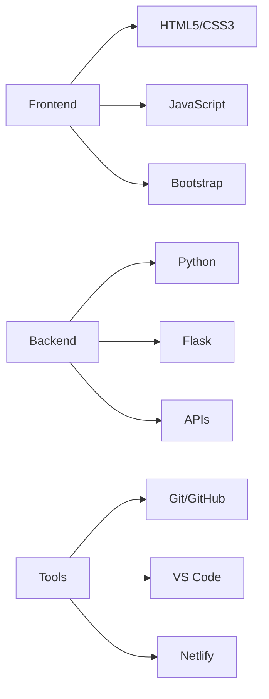

# 💫 **Tanzeel Ahmed**  
### **Full Stack Developer | Web Specialist | Tech Innovator**

<p align="center">
  
</p>

<div align="center">
  
  
  
  
  

</div>

---

## 🎯 **About Me**

```javascript
const developer = {
  name: "Tanzeel Ahmed",
  role: "Full Stack Web Developer",
  location: "Pakistan",
  expertise: ["Python", "Flask", "HTML/CSS", "JavaScript", "APIs"],
  currentlyLearning: ["React", "Node.js", "Next.js"],
  hobbies: ["Coding", "Designing", "Building Projects"],
  availability: "Open for Opportunities",
  contact: "Available for Freelance"
};
```

---

## 🚀 **Tech Stack**

### **💻 Languages**
<p>
  
  
  
  
</p>

### **⚡ Frameworks & Libraries**
<p>
  
  
  
  
</p>

### **🔧 Tools**
<p>
  
  
  
  
  
</p>

---

## 📊 **GitHub Analytics**

<div align="center">

<table>
  <tr>
    <td align="center">
      
    </td>
    <td align="center">
      
    </td>
  </tr>
  <tr>
    <td colspan="2" align="center">
      
    </td>
  </tr>
</table>

</div>

---

## 🏆 **My Real Projects**

### **🎯 1. Portfolio Website**
> **Modern & Responsive Personal Portfolio**

<p align="center">
  <a href="https://tanzeel804.github.io/portfolio-main/">


  </a>
</p>

**Live Demo:** 🔗 [View Portfolio](https://tanzeel804.github.io/portfolio-main/)

**Features:**
- 🎨 Modern UI/UX Design
- 📱 Fully Responsive
- ⚡ Fast Loading
- 📞 Contact Form
- 🎯 Project Showcase

**Tech Stack:** `HTML5` `CSS3` `JavaScript` `Bootstrap` `Netlify`

---

### **🌤️ 2. Weather App**
> **Real-time Weather Information App**

<p align="center">
  <a href="https://tanzeel804.github.io/weather-app/">
    
  </a>
</p>

**Live Demo:** 🔗 [Check Weather](https://tanzeel804.github.io/weather-app/)

**Features:**
- 🌤️ Real-time Weather
- 📍 Location-based
- 🔍 Search Any City
- 📊 Weather Details
- 🎨 Beautiful UI

**Tech Stack:** `HTML5` `CSS3` `JavaScript` `Weather API` `Netlify`

---

### **📰 3. News Hub**
> **Latest News Aggregator Website**

<p align="center">
  
</p>

**Features:**
- 📰 Latest News
- 🔄 Multiple Categories
- 🔍 Search Functionality
- 📱 Responsive Design
- 🎯 User Friendly

**Tech Stack:** `Python` `Flask` `Bootstrap` `NewsAPI` `HTML/CSS`

---

### **📁 4. File Organizer**
> **Automated File Management Tool**

<p align="center">
  
</p>

**Features:**
- 🤖 Automatic Organization
- 📂 File Categorization
- 🔄 Custom Rules
- ⚡ Fast Processing
- 🛠️ Easy to Use

**Tech Stack:** `Python` `OS Module` `Automation` `CLI Tool`

---

### **🌡️ 5. Temperature Converter**
> **Temperature Unit Conversion Tool**

<p align="center">
  
</p>

**Features:**
- 🔄 Multi-unit Conversion
- ⚡ Real-time Calculation
- 🎨 Clean Interface
- 📱 Mobile Friendly
- 🎯 Accurate Results

**Tech Stack:** `HTML5` `CSS3` `JavaScript` `Bootstrap` `Web`

---

## 📈 **Project Progress**

### **🟢 Live & Complete**
1. **Portfolio Website** - Live on GitHub Pages
2. **Weather App** - Live on GitHub Pages
3. **Temperature Converter** - Complete
4. **File Organizer** - Complete

### **🟡 In Progress**
1. **News Hub** - Under Development
2. **More Web Apps** - Coming Soon

### **🔵 Planned**
1. **E-commerce Website**
2. **Task Management App**
3. **Blog Platform**

---

## 🌟 **Skills Overview**



---

## 📱 **Project Previews**

<div align="center">

### **Portfolio Website**


### **Weather App**


### **News Hub**


</div>

---

## 🎓 **Learning Journey**

### **Currently Mastering:**
- ⚛️ **React.js** - Modern Frontend Development
- 🟢 **Node.js** - Backend JavaScript
- 🎨 **Next.js** - React Framework
- ☁️ **Cloud Deployment** - AWS/Netlify/Vercel
- 🗄️ **Databases** - MongoDB/SQL

### **Completed:**
- ✅ **Python Fundamentals**
- ✅ **Web Development Basics**
- ✅ **Git & GitHub**
- ✅ **API Integration**
- ✅ **Responsive Design**

---

## 📊 **Development Activity**

```text
🌐 Web Development  ████████████████████░░░░   85%
🐍 Python          █████████████████░░░░░░░   75%
🎨 UI/UX Design    ████████████████░░░░░░░░   70%
📱 Responsive      ██████████████████░░░░░░   80%
🔧 Tools           ███████████████████░░░░░   85%
```

---

## 🏅 **Achievements**

<div align="center">

| **Skill** | **Level** | **Projects** |
|-----------|-----------|--------------|
| Web Development | Advanced | 5+ Projects |
| Python Programming | Intermediate | 3+ Projects |
| API Integration | Intermediate | 2+ Projects |
| Git/GitHub | Advanced | All Projects |
| Responsive Design | Intermediate | 4+ Projects |

</div>

---

## 📝 **Latest Updates**

### **December 2023**
- ✅ Portfolio Website Completed & Deployed
- ✅ Weather App Launched with Real API
- 🔄 News Hub in Development Phase
- 📚 Learning React.js & Advanced JavaScript

### **Coming Soon**
- 🚀 E-commerce Website Project
- 🔥 More API-Based Applications
- 🌐 Full Stack Projects

---

## 🤝 **Let's Connect!**

<div align="center">

[](https://tanzeel804.github.io/portfolio-main/)
[](https://github.com/Tanzeel804)
[](https://linkedin.com/in/tanzeel-ahmed)
[](mailto:tanzeel.ahmed804@gmail.com)
[](https://twitter.com/tanzeel_dev)

</div>

---

## 💡 **What I Offer**

✅ **Custom Website Development**  
✅ **Responsive Web Design**  
✅ **API Integration**  
✅ **Python Automation**  
✅ **GitHub Projects Management**  
✅ **Web Application Deployment**

---

## 🎯 **Quote of the Day**

<div align="center">

> ### **"The best way to predict the future is to create it."**  
> *— Peter Drucker*

</div>

---

## 📞 **Get In Touch**

**For:**
- 💼 **Freelance Projects**
- 🤝 **Collaborations**
- 💡 **Idea Discussions**
- 🎯 **Web Development**
- 📚 **Learning Guidance**

**Response Time:** Within 24 Hours

---

<p align="center">
  
</p>

<div align="center">
  
  ### ⭐ **Check out my projects and star if you like them!** ⭐
  
  **Last Updated:** December 2023 | **Profile Version:** 4.0
  
  
  
</div>

---
