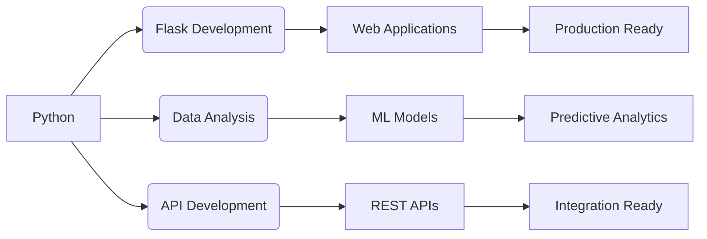

# 💫 **Tanzeel Ahmed**  
### **Full Stack Developer | Python Specialist | Tech Innovator**

<p align="center">
  
</p>

<div align="center">
  
  
  
  
  

</div>

---

## 🎯 **Quick Overview**

```javascript
const developer = {
  name: "Tanzeel Ahmed",
  role: "Full Stack Developer",
  location: "Pakistan",
  expertise: ["Python", "Flask", "Web Development", "APIs"],
  currentlyLearning: ["React", "Node.js", "MongoDB"],
  hobbies: ["Coding", "Tech Research", "Problem Solving"],
  availability: "Open for Collaborations",
  contact: "tanzeel.ahmed804@gmail.com"
};
```

---

## 🚀 **Tech Arsenal**

### **💻 Programming Languages**
<p>
  
  
  
  
  
</p>

### **⚡ Frameworks & Libraries**
<p>
  
  
  
  
</p>

### **🔧 Tools & Platforms**
<p>
  
  
  
  
  
</p>

---

## 📊 **GitHub Performance**

<div align="center">

<table>
  <tr>
    <td align="center">
      
    </td>
    <td align="center">
      
    </td>
  </tr>
  <tr>
    <td colspan="2" align="center">
      
    </td>
  </tr>
</table>

</div>

---

## 🏆 **Top Projects Showcase**

### **🎯 Project 1: News Hub**
> **Real-time News Aggregation Platform**

<p align="center">
  
</p>

**Features:**
- 🔄 Real-time news updates
- 📰 Multiple news sources
- 🔍 Advanced search functionality
- 📱 Responsive design
- 🎨 Modern UI/UX

**Tech Stack:** `Python` `Flask` `Bootstrap` `NewsAPI` `REST API`

---

### **🏥 Project 2: Hospital Management System**
> **Complete Hospital Operations Management**

<p align="center">
  
</p>

**Features:**
- 👨‍⚕️ Patient management
- 📅 Appointment scheduling
- 💊 Inventory tracking
- 📊 Reports generation
- 🔐 Secure authentication

**Tech Stack:** `Python` `Flask` `SQL` `HTML/CSS` `JavaScript`

---

### **🚗 Project 3: Car Price Predictor**
> **Machine Learning Price Prediction System**

<p align="center">
  
</p>

**Features:**
- 🤖 ML-based predictions
- 📈 Data visualization
- 🔄 Model training
- 📊 Performance metrics
- 🎯 Accurate predictions

**Tech Stack:** `Python` `Scikit-learn` `Pandas` `NumPy` `Matplotlib`

---

## 📈 **Project Metrics**

<div align="center">

| **Metric** | **Count** | **Status** |
|------------|-----------|------------|
| Total Repositories | 15+ | 📊 |
| Code Contributions | 500+ | 📈 |
| Project Languages | 5+ | 🌐 |
| API Integrations | 10+ | 🔗 |
| Database Projects | 3+ | 💾 |

</div>

---

## 🌟 **Featured Skills Matrix**



---

## 🏅 **Achievements & Badges**

<div align="center">

| **Category** | **Badge** | **Description** |
|--------------|-----------|-----------------|
| 🐍 Python Expert |  | Advanced Python Projects |
| 🌐 Web Developer |  | Full Stack Applications |
| 🔧 Problem Solver |  | 100+ Problems Solved |
| 📊 Data Analyst |  | Data Processing Projects |
| 🚀 Fast Learner |  | Quick Technology Adoption |

</div>

---

## 📚 **Learning Progress**

### **Current Focus Areas:**
1. **MERN Stack Development** - Building modern web apps
2. **Cloud Deployment** - AWS, Docker, CI/CD
3. **Advanced Python** - Django, FastAPI, Async Programming
4. **Database Optimization** - MongoDB, Redis, Postgres
5. **DevOps Practices** - Kubernetes, Jenkins, Terraform

### **Progress Trackers:**
```progress-bars
Python: 90%
Flask: 85%
JavaScript: 70%
SQL: 80%
Git: 95%
React: 50%
Node.js: 40%
MongoDB: 35%
```

---

## 🤝 **Let's Collaborate!**

I'm always open to:
- 💼 **Freelance Projects**
- 🤝 **Open Source Contributions**
- 🚀 **Startup Collaborations**
- 📚 **Learning Partnerships**
- 💡 **Tech Discussions**

---

## 📞 **Connect With Me**

<div align="center">

[](https://tanzeel.vercel.app)
[](https://linkedin.com/in/tanzeel-ahmed)
[](https://twitter.com/tanzeel_dev)
[](https://github.com/Tanzeel804)
[](mailto:tanzeel.ahmed804@gmail.com)
[](https://t.me/tanzeel_dev)

</div>

---

## 💬 **Testimonials**

> "Tanzeel's projects demonstrate exceptional problem-solving skills and clean code practices."  
> *— Tech Reviewer*

> "A dedicated developer with great attention to detail and project execution."  
> *— Project Collaborator*

---

## 🎨 **GitHub Trophies**

<div align="center">
  


</div>

---

## 📊 **Weekly Development Breakdown**

```text
🐍 Python           ████████████████████░░░░   85%
🌐 JavaScript       ██████████████░░░░░░░░░░   60%
📊 SQL             ██████████████████░░░░░░   80%
🎨 HTML/CSS        █████████████████░░░░░░░   75%
🔧 Flask           ████████████████████░░░░   90%
⚛️ React           ██████████░░░░░░░░░░░░░░   50%
```

---

## ✨ **GitHub Highlights**

```yaml
current_streak: "7 days"
longest_streak: "30 days"
total_contributions: 500+
public_repositories: 15+
stars_received: 25+
forks: 10+
issues_created: 8+
pull_requests: 12+
```

---

## 📝 **Latest Blog Posts** *(Coming Soon)*

1. **Building Scalable Flask Applications**
2. **Python Tips for Intermediate Developers**
3. **From Zero to Hero in Web Development**
4. **API Development Best Practices**
5. **Git & GitHub Mastery Guide**

---

## 🎯 **Quote of the Day**

<div align="center">

> ### **"Code is like humor. When you have to explain it, it's bad."**  
> *— Cory House*

</div>

---

<p align="center">
  
</p>

<div align="center">
  
  ### ⭐ **Star my repositories if you find them useful!** ⭐
  
  
  
  **Last Updated:** December 2023 | **Profile Version:** 3.0
  
</div>


---
